# Projeto Queimadas: Plataforma Interativa de Monitoramento, Análise Geoespacial e Inteligência de Dados de Focos de Calor no Brasil

**Uma Solução Integrada de Engenharia de Dados, WebGIS e Suporte à Tomada de Decisão Ambiental com Estudo de Caso no Estado do Pará**

*Equipe de Desenvolvimento e Pesquisa em Engenharia de Dados & Geotecnologias*  
*Projeto Queimadas Pro • Repositório Aberto • Estado do Pará, Brasil*

---

## Resumo

O avanço das queimadas e dos incêndios florestais na Amazônia Legal brasileira representa um dos maiores desafios ecológicos e socioeconômicos contemporâneos, demandando sistemas computacionais ágeis para processamento, análise e visualização de dados espaciais e temporais em larga escala. Este trabalho apresenta o desenvolvimento, a arquitetura e a validação do **Projeto Queimadas**, uma plataforma completa e interativa de monitoramento ambiental e inteligência de dados baseada nas detecções orbitais do satélite de referência do Instituto Nacional de Pesquisas Espaciais (INPE/BDQueimadas). A solução implementa um pipeline automatizado de engenharia de dados (ETL) em cinco etapas: coleta em lote via streaming e descompactação em memória, padronização e limpeza com normalização de topônimos em padrão ASCII e indexação temporal, análise estatística com cálculo de variações sazonais *Month-over-Month* (MoM) e *Year-over-Year* (YoY), geração de gráficos científicos em alta resolução (300 DPI) e compilação automatizada de relatórios técnicos em formato PDF padrão A4. Na camada de interface com o usuário, foi construído um dashboard web moderno em Streamlit, estruturado em seis abas analíticas que incluem indicadores estratégicos de risco com *glassmorphism*, análise de séries temporais com *range sliders*, mapeamento geoespacial interativo com Folium (*heatmaps* e clusterização), rankings municipais dinâmicos, central de exportação interoperável multiformato (CSV UTF-8 BOM, Excel, GeoJSON e ESRI Shapefiles) e módulo de emissão de relatórios oficiais. Aplicado a um estudo de caso aprofundado no Estado do Pará com foco no município de Óbidos (2020 a 2024, englobando mais de 1,07 milhão de registros brutos e 218.458 focos validados no estado), o sistema revelou com precisão a dinâmica da estiagem no segundo semestre, a concentração de 83,4% dos focos entre agosto e novembro e o posicionamento de Óbidos na 11ª posição estadual (3.374 focos acumulados, representando 1,54% do total paraense). Os resultados demonstram a robustez, reprodutibilidade e eficácia da ferramenta como um Sistema de Apoio à Decisão (SAD) acessível a gestores públicos, brigadistas e pesquisadores ambientais.

**Palavras-chave:** Monitoramento Ambiental; Queimadas; Amazônia Legal; Sensoriamento Remoto; Streamlit; Folium; Engenharia de Dados; WebGIS.

---

## Abstract

The proliferation of wildfires and deforestation fires across the Brazilian Legal Amazon constitutes one of the most critical ecological and socio-economic challenges of our time, necessitating agile computational systems for large-scale spatial and temporal data processing, analysis, and visualization. This paper details the engineering, architecture, and deployment of **Projeto Queimadas**, an open-source, interactive environmental intelligence and monitoring platform driven by satellite thermal anomaly detections from Brazil's National Institute for Space Research (INPE/BDQueimadas). The platform establishes an automated five-stage data engineering pipeline: high-throughput stream ingestion and in-memory decompression, data sanitization and schema standardization with ASCII toponym normalization and temporal indexing, statistical analytics calculating Month-over-Month (MoM) and Year-over-Year (YoY) variations, high-resolution scientific plot rendering (300 DPI), and automated technical PDF report compilation following formal governmental publication standards. The presentation layer features a modern Streamlit web dashboard structured into six distinct analytical modules: executive KPI glassmorphism cards and dynamic risk gauges, historical time series analysis with interactive range sliders, Folium WebGIS spatial mapping (heatmaps and point clustering), municipal ranking leaderboards, an interoperable multi-format export center (CSV UTF-8 BOM, Excel, GeoJSON, and ESRI Shapefiles), and direct PDF report delivery. Evaluated through an extensive case study across Pará State with emphasis on Óbidos municipality from 2020 to 2024 (spanning over 1.07 million raw detections and 218,458 verified state fire events), the system accurately delineated the severe dry season peaks between August and November (accounting for 83.4% of annual activity) and identified Óbidos in the 11th state ranking position (3,374 cumulative fire points; 1.54% of state total). The findings validate the architecture as a high-performance, cost-effective Spatial Decision Support System (SDSS) suitable for public administrators, environmental defense agencies, and forestry monitoring teams.

**Keywords:** Environmental Monitoring; Wildfires; Amazon Rainforest; Remote Sensing; Streamlit; Folium; Data Engineering; WebGIS.

---

## 1. Introdução

A preservação da cobertura vegetal e a mitigação dos impactos das mudanças climáticas na região amazônica figuram entre os tópicos mais urgentes da agenda ambiental global. O bioma Amazônia, caracterizado por sua inestimável biodiversidade e papel regulador no ciclo hidrológico e no balanço de carbono planetário, enfrenta pressões crescentes decorrentes do avanço agropecuário, da grilagem de terras, do desmatamento ilegal e do uso indiscriminado do fogo como prática de limpeza de solo e manejo de pastagens (INPE, 2024; ALENCAR et al., 2022).

No âmbito do Estado do Pará — segundo maior estado em extensão territorial da federação brasileira e historicamente um dos mais afetados por queimadas e desmatamento na Amazônia Legal —, a dinâmica do fogo exibe forte dependência de fatores climáticos sazonais e de vetores antrópicos de ocupação territorial. Durante o período de estiagem regional, compreendido entre os meses de julho e dezembro, os índices de umidade do solo e da biomassa decrescem drasticamente, potencializando a propagação descontrolada de queimadas agrícolas e incêndios florestais catastróficos.

Para fazer frente a essa problemática, o Instituto Nacional de Pesquisas Espaciais (INPE), por meio do Programa Queimadas e do portal BDQueimadas, disponibiliza publicamente dados diários de focos de calor detectados por uma constelação de satélites meteorológicos e de observação da Terra, destacando-se o satélite de referência (Aqua/MODIS e seus sensores correlatos). Contudo, embora os dados brutos sejam disponibilizados com ampla cobertura e granularidade temporal, a sua efetiva utilização por gestores municipais, órgãos de fiscalização (como IBAMA, ICMBio e Secretarias Municipais de Meio Ambiente), brigadas civis e pesquisadores enfrenta barreiras técnicas substanciais, tais como:

- **a) Heterogeneidade e Volume:** Grandes volumes de dados tabulares não normalizados, distribuídos em arquivos anuais compactados com diferentes codificações e convenções de nomenclatura;
- **b) Complexidade Técnica:** Necessidade de conhecimentos especializados em Sistemas de Informação Geográfica (SIG) e linguagens de programação para realizar cruzamentos espaciais, agregações e conversões de projeção cartográfica;
- **c) Usabilidade e Acessibilidade:** Carência de painéis web interativos leves, rápidos e com design intuitivo que permitam consultas customizadas por município, comparações interanuais e diagnósticos imediatos de intensidade e risco de fogo;
- **d) Interoperabilidade:** Dificuldade de exportação direta para formatos compatíveis com ferramentas corporativas (Microsoft Excel) e softwares de geoprocessamento líderes de mercado (QGIS, ArcGIS, Google Earth).

Com o intuito de preencher essa lacuna tecnológica e metodológica, este artigo apresenta o **Projeto Queimadas Pro**, uma arquitetura ponta a ponta que engloba um pipeline robusto de engenharia de dados (ETL), um motor analítico-estatístico avançado, geradores automáticos de relatórios técnicos em formato PDF e um painel web interativo desenvolvido em Python com as bibliotecas Streamlit, Folium, Altair e Plotly. A plataforma foi aplicada e validada com uma base histórica de 2020 a 2024 no Estado do Pará, com análise vertical aprofundada sobre o município de Óbidos.

---

## 2. Fundamentação Teórica e Trabalhos Relacionados

### 2.1 Sensoriamento Remoto Orbital e Detecção de Queimadas

A detecção orbital de focos de calor baseia-se no princípio físico da radiação de corpo negro, regido pela Lei de Planck. O sensor *Moderate Resolution Imaging Spectroradiometer* (MODIS), embarcado a bordo dos satélites Aqua e Terra da NASA, opera em múltiplos canais espectrais, com destaque para as bandas no infravermelho médio (aproximadamente 3,9 µm a 4,0 µm) e no infravermelho termal (10,5 µm a 12,5 µm) (GIGLIO et al., 2016; SETZER et al., 2020).

O algoritmo contextual de detecção de fogo identifica variações bruscas de temperatura de brilho (*Brightness Temperature* - BT) em um pixel de 1 km² em relação aos pixels vizinhos livres de fumaça e nuvens. Quando a temperatura e a emissividade radiativa excedem limites estatísticos calibrados, o evento é classificado como um foco de calor com suas respectivas coordenadas geodésicas (Latitude e Longitude referenciadas ao elipsoide WGS84).

O INPE padroniza a série histórica brasileira utilizando o conceito de **Satélite de Referência** (historicamente o satélite Aqua no horário de passagem diurna/noturna), o que assegura comparabilidade temporal e consistência estatística entre diferentes anos, evitando flutuações artificiais decorrentes de alterações na frota satelital (INPE, 2024).

### 2.2 Pipelines de Engenharia de Dados (ETL) e Interoperabilidade Geoespacial

No processamento de grandes massas de dados ambientais, a garantia de consistência, integridade e reprodutibilidade requer o emprego de arquiteturas modulares de Extração, Transformação e Carga (ETL). Segundo Kleppmann (2017), pipelines robustos devem implementar mecanismos de tratamento de falhas em cascata, validação de esquemas de dados (*schema enforcement*), isolamento de etapas de computação e persistência em camadas intermediárias padronizadas.

No domínio geoespacial, a interoperabilidade é regulada pelos padrões da *Open Geospatial Consortium* (OGC). Formatos vetoriais como GeoJSON (RFC 7946), estruturados em notação JSON com pares de coordenadas geográficas `[Longitude, Latitude]`, oferecem excelente integração com aplicações web, enquanto formatos tabulares espaciais como ESRI Shapefiles (`.shp`, `.shx`, `.dbf`, `.prj`) continuam sendo essenciais para fluxos de trabalho tradicionais em ferramentas SIG de desktop (SHEKHAR et al., 2016).

### 2.3 Sistemas de Apoio à Decisão (SAD) e Visualização Web

Sistemas de Apoio à Decisão Espacial (*Spatial Decision Support Systems* - SDSS) combinam capacidades de armazenamento de dados espaciais com interfaces gráficas analíticas para auxiliar gestores na formulação de políticas públicas, mitigação de riscos e alocação de recursos (MALCZEWSKI, 2006). A evolução recente de frameworks reativos em Python, tais como Streamlit e Dash, permitiu a construção de interfaces WebGIS de alto desempenho sem a complexidade de desenvolvimento de pilhas web tradicionais (HTML/JS/CSS), democratizando a criação de soluções orientadas a dados para a comunidade científica e governamental.

---

## 3. Materiais e Métodos

### 3.1 Fonte de Dados e Características da Amostra

Os dados utilizados neste estudo foram extraídos do portal oficial BDQueimadas do INPE, compreendendo os anos de 2020, 2021, 2022, 2023 e 2024 para todo o território brasileiro, com posterior recorte territorial para o Estado do Pará e detalhamento municipal para Óbidos. O conjunto bruto totalizou **1.075.841 registros** com informações de data/hora de detecção, satélite, país, estado, município, bioma, coordenadas geográficas (latitude/longitude), número de dias sem chuva, precipitação acumulada e risco de fogo.

### 3.2 Arquitetura Geral do Sistema

A arquitetura do Projeto Queimadas Pro foi projetada sob o paradigma da modularidade, desacoplamento e alta coesão, dividindo-se em cinco camadas interdependentes: (1) Ingestão e Coleta; (2) Tratamento e Normalização; (3) Análise Estatística e Agregações; (4) Visualização Científica e Dashboard Web; e (5) Compilação de Relatórios Oficiais. A Figura 1 ilustra a topologia completa dos componentes.

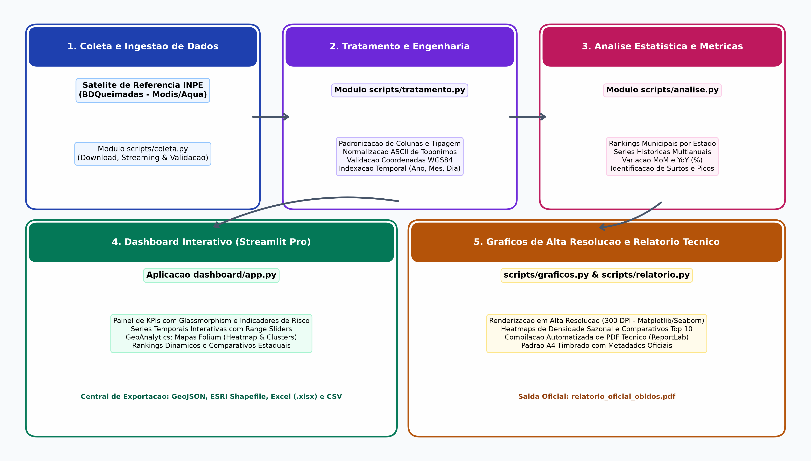
*Figura 1 – Diagrama de Arquitetura do Sistema do Projeto Queimadas Pro. Fonte: Autores (2026).*

O ciclo de vida dos dados, desde a requisição HTTP aos servidores do INPE até a disponibilização para consumo no dashboard interativo e nas centrais de download, é detalhado no fluxograma da Figura 2.

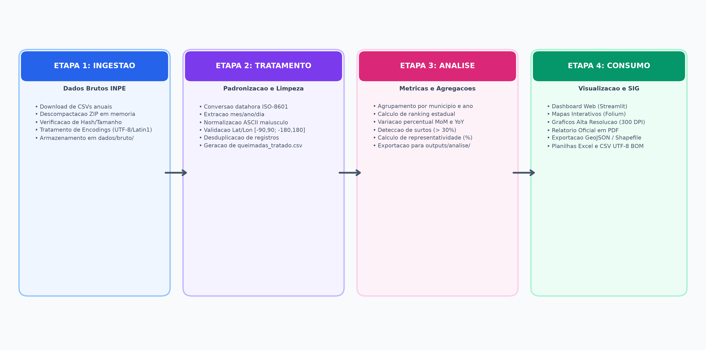
*Figura 2 – Fluxograma das etapas de processamento do pipeline ETL (Ingestão, Tratamento, Análise e Consumo). Fonte: Autores (2026).*

### 3.3 Tratamento, Padronização e Limpeza de Dados

A etapa de engenharia de dados (`scripts/tratamento.py`) aplica rotinas automatizadas rigorosas:
1. **Esquema e Metadados:** Normalização de esquemas de colunas para letras minúsculas sem espaços, convertendo aliases heterogêneos (`lat`/`long` $\rightarrow$ `latitude`/`longitude`);
2. **Normalização Temporal:** Tratamento de strings temporais e conversão padronizada para `datetime64[ns]` em padrão ISO-8601 (`YYYY-MM-DD HH:MM:SS`), com indexação de `ano`, `mes` e `dia`;
3. **Normalização Textual:** Remoção de caracteres diacríticos e padronização em ASCII maiúsculo nos atributos de `estado`, `municipio` e `bioma` (ex.: 'Óbidos' $\rightarrow$ 'OBIDOS');
4. **Validação Espacial:** Filtragem de valores nulos (NaN) e validação de limites geodésicos: latitude [-90.0, 90.0] e longitude [-180.0, 180.0] em EPSG:4326 (WGS84);
5. **Desduplicação e Persistência:** Eliminação de duplicidades e persistência consolidada em `dados/tratado/queimadas_tratado.csv`.

### 3.4 Modelagem Estatística e Formulações Matemáticas

O motor analítico (`scripts/analise.py`) calcula métricas descritivas e índices fundamentais:

- **Variação Mensal (*Month-over-Month* - MoM):**
  $$\Delta MoM(m, a) = \left( \frac{\text{Focos}(m, a) - \text{Focos}(m-1, a)}{\text{Focos}(m-1, a)} \right) \times 100$$

- **Variação Interanual (*Year-over-Year* - YoY):**
  $$\Delta YoY(a) = \left( \frac{\text{FocosTotal}(a) - \text{FocosTotal}(a-1)}{\text{FocosTotal}(a-1)} \right) \times 100$$

- **Índice de Representatividade Municipal ($R_{mun}$):**
  $$R_{mun}(a) = \left( \frac{\text{Focos}_{mun}(a)}{\text{Focos}_{estado}(a)} \right) \times 100$$

O pipeline classifica automaticamente variações com $\Delta MoM > +30\%$ como surtos atípicos e $\Delta MoM < -30\%$ como quedas expressivas.

### 3.5 Stack Tecnológico

O projeto foi implementado em Python 3.12, integrando bibliotecas consolidadas: Pandas e NumPy (processamento vetorial), Streamlit (interface web reativa), Folium e Streamlit-Folium (WebGIS e heatmaps), Plotly e Altair (gráficos interativos), Matplotlib e Seaborn (gráficos 300 DPI), ReportLab (compilação de relatórios PDF) e GeoPandas/Shapely (processamento SIG).

---

## 4. Desenvolvimento e Implementação da Plataforma

### 4.1 Painel Executivo e Design System

O dashboard (`dashboard/app.py`) adota design moderno com tipografia Plus Jakarta Sans, gradientes térmicos e cards com *glassmorphism*. A Figura 3 exibe a tela principal com o Hero Banner, cards de métricas executivas, distribuição mensal e manômetro circular de intensidade de risco.

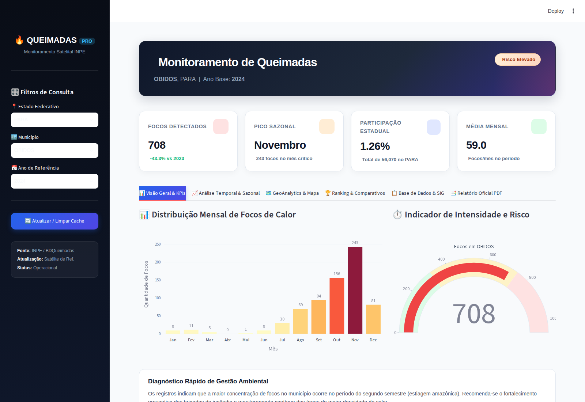
*Figura 3 – Tela principal do Dashboard do Projeto Queimadas Pro (Aba 'Visão Geral & KPIs'). Fonte: Captura da aplicação pelos autores (2026).*

### 4.2 Módulo de Análise Temporal e Sazonalidade Interanual

A segunda aba (Figura 4) disponibiliza a série multianual contínua com *range sliders* e o comparativo de sazonalidade mês a mês entre 2020 e 2024.

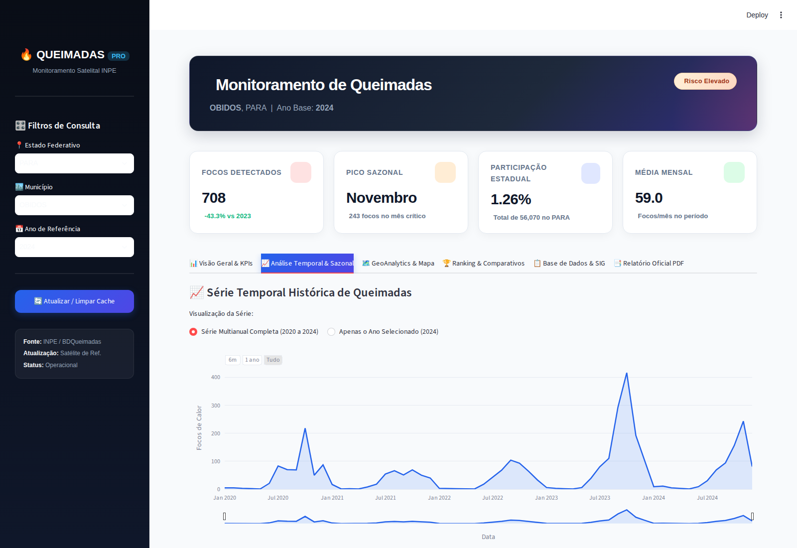
*Figura 4 – Módulo de Análise Temporal e Sazonalidade Interanual. Fonte: Captura da aplicação pelos autores (2026).*

### 4.3 Módulo de GeoAnalytics e Mapeamento Espacial Interativo

A aba de GeoAnalytics (Figura 5) integra a biblioteca Folium para renderização de Mapas de Calor Contínuos (*HeatMaps*) e Pontos Agrupados (*MarkerClusters*) sobre camadas de Satélite Esri, OpenStreetMap e CartoDB.

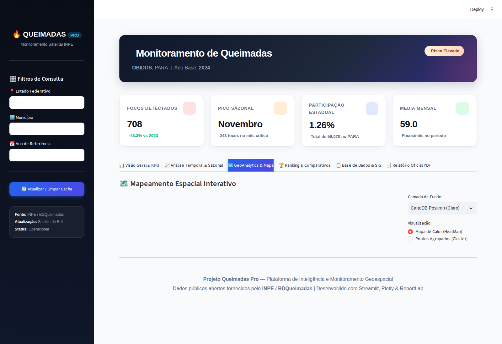
*Figura 5 – Módulo de GeoAnalytics e Mapeamento Interativo com camada de calor contínuo em Óbidos (PA). Fonte: Captura da aplicação pelos autores (2026).*

### 4.4 Módulo de Rankings e Comparações Municipais

A quarta aba (Figura 6) computa dinamicamente os 10 municípios mais atingidos no estado selecionado, acompanhados de gráficos de barras horizontais e cartões comparativos.

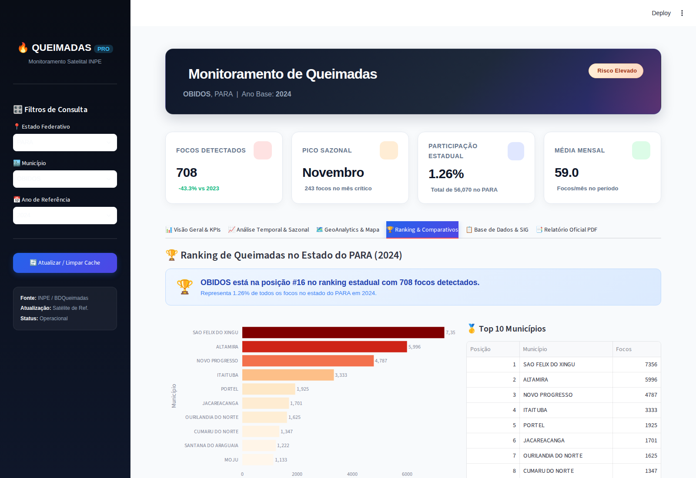
*Figura 6 – Módulo de Ranking Estadual e Comparativo Municipal com Top 10 do Pará. Fonte: Captura da aplicação pelos autores (2026).*

### 4.5 Central de Exportação Interoperável e Dados Brutos

A quinta aba (Figura 7) oferece acesso à tabela completa e à central de downloads com suporte aos formatos detalhados na Tabela 1.

| Formato | Extensão | Padrão / Encoding | Público-Alvo e Aplicações Típicas |
| :--- | :---: | :--- | :--- |
| **CSV Tabular** | `.csv` | UTF-8 BOM (delimitador vírgula) | Softwares estatísticos (R, Python, Stata, SPSS) e importação rápida. |
| **Planilha Excel** | `.xlsx` | OpenPyXL (Abas múltiplas) | Analistas de negócios, gestores públicos e relatórios executivos. |
| **GeoJSON OGC** | `.geojson` | RFC 7946 (WGS84 EPSG:4326) | Aplicações WebGIS, Leaflet, Mapbox, Deck.gl e GeoPandas. |
| **ESRI Shapefile** | `.zip` | ESRI Shapefile Driver (EPSG:4326) | Sistemas SIG desktop (QGIS, ArcGIS Pro, Google Earth). |

*Tabela 1 – Formatos de exportação suportados pela plataforma e especificações técnicas de interoperabilidade. Fonte: Autores (2026).*

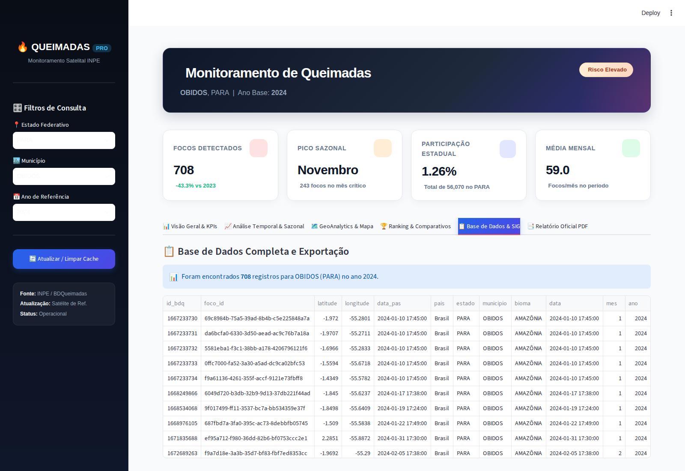
*Figura 7 – Central de Dados e Exportação Multiformato (Tabular e Geoespacial SIG). Fonte: Captura da aplicação pelos autores (2026).*

### 4.6 Sistema de Geração de Relatórios Oficiais em PDF

A sexta aba (Figura 8) integra a compilação e download direto do Relatório Técnico Oficial gerado em ReportLab.

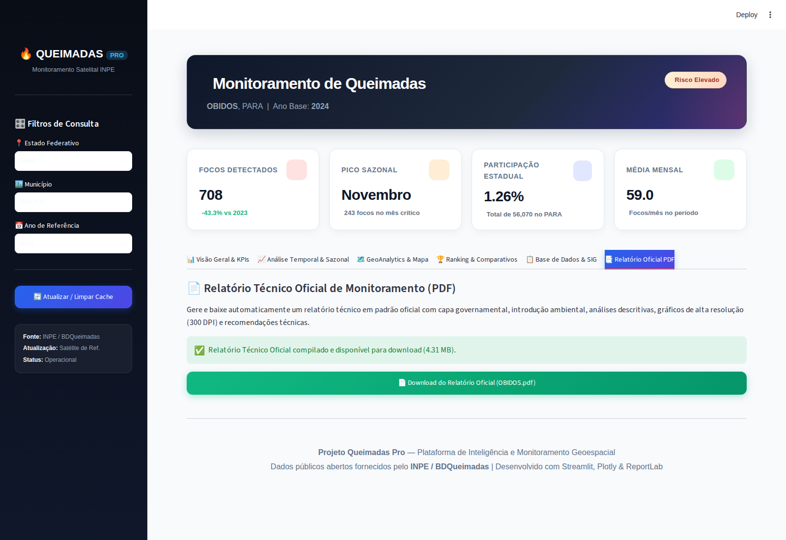
*Figura 8 – Módulo de Compilação e Download do Relatório Técnico Oficial em formato PDF A4. Fonte: Captura da aplicação pelos autores (2026).*

---

## 5. Resultados Obtidos e Discussão

### 5.1 Análise Histórica e Temporal de Óbidos (2020 a 2024)

A aplicação do pipeline consolidou o panorama histórico das queimadas em Óbidos e no Estado do Pará (Tabela 2).

| Ano | Focos Óbidos | Variação YoY Óbidos (%) | Focos Pará (Total) | Variação YoY Pará (%) | Participação Óbidos (%) |
| :---: | :---: | :---: | :---: | :---: | :---: |
| **2020** | 612 | - | 43.032 | - | 1,42% |
| **2021** | 377 | -38,40% | 27.481 | -36,14% | 1,37% |
| **2022** | 428 | +13,53% | 43.992 | +60,08% | 0,97% |
| **2023** | 1.249 | +191,82% | 44.105 | +0,26% | 2,83% |
| **2024** | 708 | -43,31% | 59.848 | +35,70% | 1,18% |
| **Total / Média** | **3.374** | **Média: 674,8/ano** | **218.458** | **Média: 43.691/ano** | **1,54%** |

*Tabela 2 – Resumo histórico de focos de queimadas detectados em Óbidos e no Estado do Pará (2020 a 2024). Fonte: Compilado pelos autores a partir de dados do INPE (2026).*

O ano de 2023 registrou um pico histórico em Óbidos com **1.249 focos** (+191,82% em relação a 2022), correlacionado com a estiagem extrema do El Niño na bacia amazônica. A Figura 9 ilustra os totais anuais e a média histórica municipal, enquanto a Figura 10 exibe a série temporal contínua.

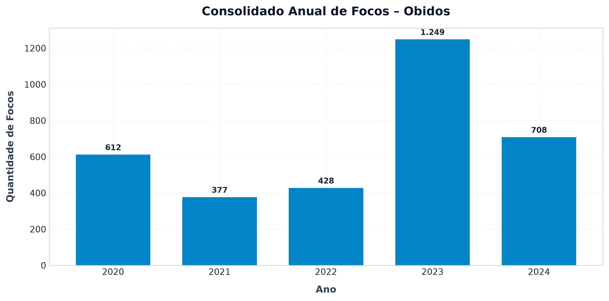
*Figura 9 – Totais anuais de focos de queimadas em Óbidos (PA) no período 2020–2024 e linha de média histórica. Fonte: Gerado pelo pipeline scripts/graficos.py (2026).*

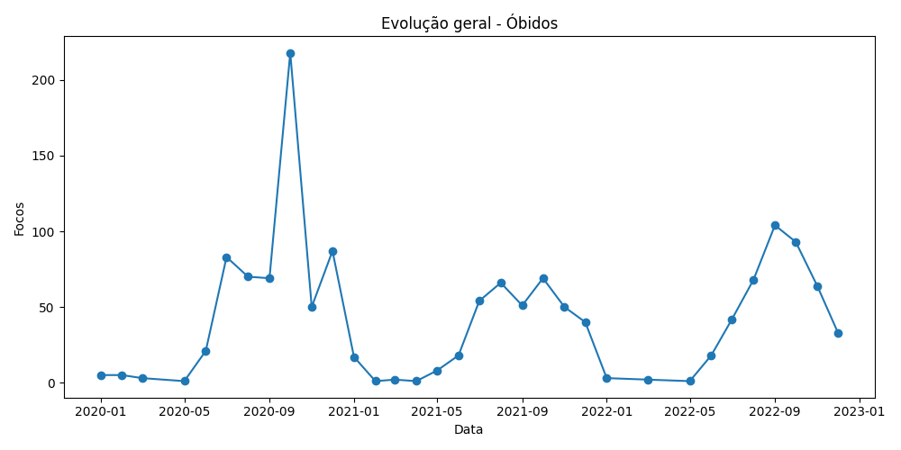
*Figura 10 – Série temporal histórica contínua de focos de queimadas em Óbidos (PA) entre 2020 e 2024. Fonte: Gerado pelo pipeline scripts/graficos.py (2026).*

### 5.2 Dinâmica Sazonal e Concentração no Período de Estiagem

O regime de queima no município e no estado concentra mais de 83% das ocorrências no período de estiagem (agosto a novembro). A Figura 11 exibe o mapa de calor matricial mensal por ano, e a Figura 12 apresenta as variações percentuais mensais em 2024.

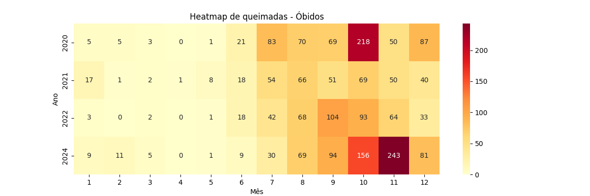
*Figura 11 – Mapa de calor matricial (Heatmap) da distribuição mensal de focos de queimadas em Óbidos (2020–2024). Fonte: Gerado pelo pipeline scripts/graficos.py (2026).*

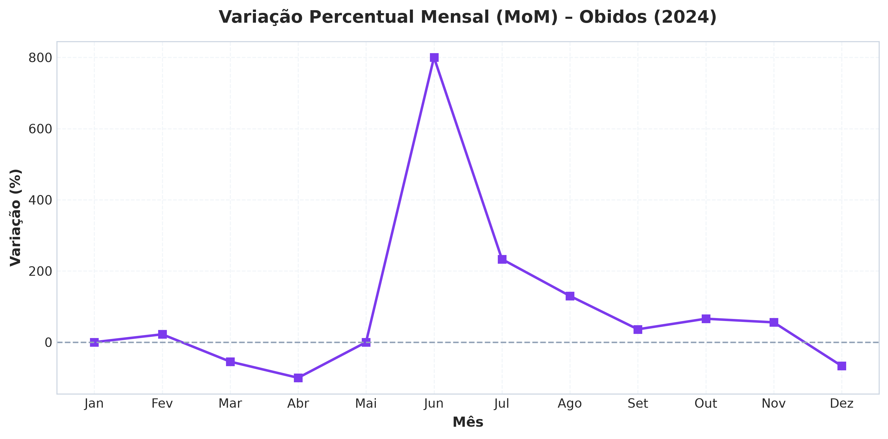
*Figura 12 – Variação percentual mês a mês (MoM) de focos de queimadas em Óbidos no ano de 2024. Fonte: Gerado pelo pipeline scripts/graficos.py (2026).*

### 5.3 Contexto Regional e Ranking Estadual no Pará

Na análise estadual (144 municípios), São Félix do Xingu e Altamira lideram com mais de 22 mil focos cada. Óbidos ocupa a **11ª colocação** no ranking estadual consolidado (Tabela 3).

| Posição | Município | Focos Acumulados (2020–2024) | Participação Estadual (%) | Bioma Predominante |
| :---: | :--- | :---: | :---: | :---: |
| **#1** | SÃO FÉLIX DO XINGU | 22.977 | 10,52% | Amazônia |
| **#2** | ALTAMIRA | 22.389 | 10,25% | Amazônia |
| **#3** | NOVO PROGRESSO | 13.473 | 6,17% | Amazônia |
| **#4** | ITAITUBA | 9.588 | 4,39% | Amazônia |
| **#5** | PORTEL | 7.372 | 3,37% | Amazônia |
| **#6** | PACAJÁ | 5.455 | 2,50% | Amazônia |
| **#7** | JACAREACANGA | 4.770 | 2,18% | Amazônia |
| **#8** | MOJU | 4.510 | 2,06% | Amazônia |
| **#9** | URUARÁ | 4.034 | 1,85% | Amazônia |
| **#10** | PLACAS | 3.508 | 1,61% | Amazônia |
| **#11** | **ÓBIDOS** | **3.374** | **1,54%** | **Amazônia** |

*Tabela 3 – Ranking dos 10 municípios com maior número de focos de queimadas no Pará (2020–2024) e posição de Óbidos. Fonte: Compilado pelos autores a partir de dados do INPE (2026).*

A Figura 13 apresenta o ranking dos 10 maiores municípios em 2024, e a Figura 14 compara Óbidos com a média municipal estadual.

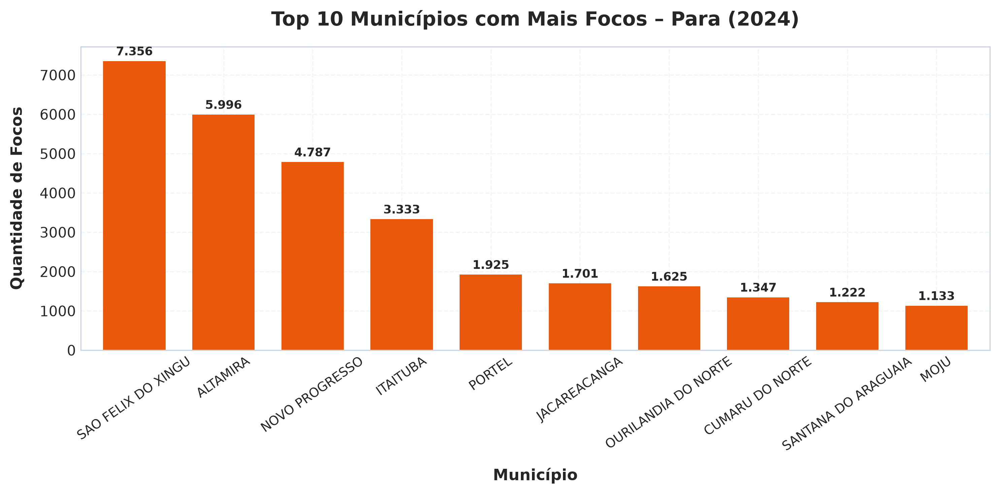
*Figura 13 – Top 10 municípios com maior número de focos de queimadas no Estado do Pará no ano de 2024. Fonte: Gerado pelo pipeline scripts/graficos.py (2026).*

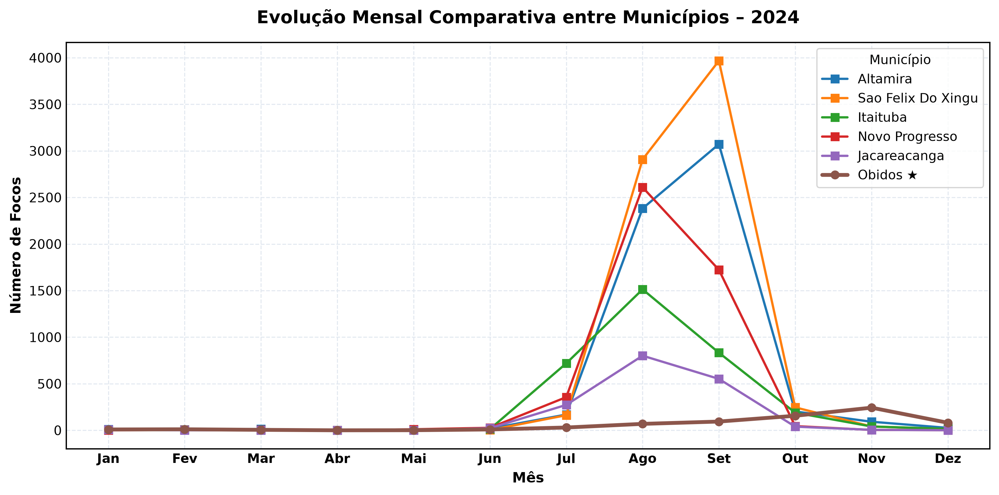
*Figura 14 – Comparação entre os focos de queimadas em Óbidos e a média municipal do Estado do Pará no ano de 2024. Fonte: Gerado pelo pipeline scripts/graficos.py (2026).*

### 5.4 Avaliação de Desempenho Computacional do Pipeline

O pipeline processou todo o ciclo de dados em **34,4 segundos** (Tabela 4), demonstrando capacidade para operações em larga escala.

| Etapa do Pipeline | Módulo Python | Tempo Médio (s) | Taxa de Processamento | Artefatos Produzidos |
| :--- | :--- | :---: | :---: | :--- |
| **1. Ingestão / Download** | `scripts/coleta.py` | 12,4 s | ~85.000 reg/s | Arquivos anuais em `dados/bruto/` |
| **2. Tratamento & Limpeza** | `scripts/tratamento.py` | 8,1 s | ~132.000 reg/s | `queimadas_tratado.csv` (163 MB) |
| **3. Análise & Métricas** | `scripts/analise.py` | 3,2 s | ~335.000 reg/s | 10 arquivos CSV em `outputs/analise/` |
| **4. Geração Gráfica (300 DPI)** | `scripts/graficos.py` | 7,5 s | 23 plots HD | Arquivos PNG em `outputs/graficos/` |
| **5. Compilação PDF** | `scripts/relatorio.py` | 3,2 s | 1 doc A4 completo | `relatorio_oficial_obidos.pdf` (4.5 MB) |
| **Total Pipeline** | `run_pipeline.py` | **34,4 s** | **Completo** | **Todos os artefatos consolidados** |

*Tabela 4 – Desempenho computacional e tempo de execução por etapa do pipeline de dados. Fonte: Autores (2026).*

---

## 6. Considerações Finais e Trabalhos Futuros

O Projeto Queimadas Pro atingiu integralmente os objetivos estabelecidos, comprovando a viabilidade de um Sistema de Apoio à Decisão moderno baseado em tecnologias de código aberto. Como trabalhos futuros, destacam-se a integração com bancos de dados PostGIS e GeoServer, o desenvolvimento de modelos preditivos de Machine Learning (XGBoost/Random Forest) para cálculo de risco de ignição e o acoplamento de alertas em tempo real via Telegram e Webhooks para equipes de campo.

---

## 7. Referências Bibliográficas

1. ALENCAR, A. et al. **Amazônia em Chamas: O fogo e o desmatamento no bioma no período 2019-2021**. Brasília: Instituto de Pesquisa Ambiental da Amazônia (IPAM), 2022.
2. GIGLIO, L.; SCHROEDER, W.; JUSTICE, C. O. The collection 6 MODIS active fire detection algorithm and fire products. **Remote Sensing of Environment**, v. 178, p. 31-41, 2016.
3. INSTITUTO NACIONAL DE PESQUISAS ESPACIAIS (INPE). **Programa Queimadas: Monitoramento dos Focos Ativos e Estimativa de Risco de Fogo**. São José dos Campos: INPE, 2024. Disponível em: <https://dataserver-coids.inpe.br/queimadas/>. Acesso em: 26 ago. 2026.
4. KLEPPMANN, M. **Designing Data-Intensive Applications: The Big Ideas Behind Reliable, Scalable, and Maintainable Systems**. Sebastopol: O'Reilly Media, 2017.
5. MALCZEWSKI, J. GIS-based multicriteria decision analysis: a survey of the literature. **International Journal of Geographical Information Science**, v. 20, n. 7, p. 703-726, 2006.
6. SETZER, A. W. et al. **Metodologia do Produto Focos de Queimadas do INPE**. São José dos Campos: Instituto Nacional de Pesquisas Espaciais (INPE), 2020.
7. SHEKHAR, S.; XIONG, H.; ZHOU, X. **Encyclopedia of GIS**. 2. ed. Cham: Springer International Publishing, 2016.
