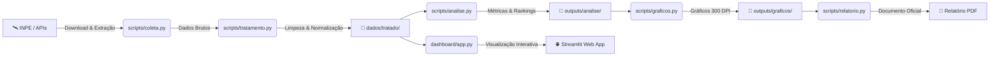

<div align="center">

# 🔥 Projeto Queimadas: Monitoramento e Análise Espacial

[](https://github.com/uwagnerleand/projeto-queimadas/actions/workflows/ci.yml)
[](https://www.python.org/)
[](https://streamlit.io/)
[](LICENSE)
[](https://github.com/astral-sh/ruff)

**Plataforma de inteligência de dados, análise geoespacial e monitoramento temporal de focos de queimadas no Brasil (com ênfase no Estado do Pará e Município de Óbidos) a partir de dados satelitais do INPE.**

[Visão Geral](#-visão-geral) •
[Funcionalidades](#-funcionalidades) •
[Arquitetura](#-arquitetura) •
[Instalação](#-instalação-e-configuração) •
[Uso](#-como-executar) •
[Testes](#-testes-e-qualidade) •
[Estrutura](#-estrutura-do-projeto) •
[Licença](#-licença)

</div>

---

## 📖 Visão Geral

O **Projeto Queimadas** é uma solução completa de engenharia e ciência de dados projetada para transformar dados públicos e complexos de satélites em inteligência ambiental acionável. Integrando dados do **satélite de referência do INPE**, o sistema fornece:

1. **Pipeline ETL Automatizado**: Ingestão, limpeza, padronização e normalização de grandes volumes de dados geoespaciais e temporais.
2. **Dashboard Interativo em Streamlit**: Interface visual moderna e responsiva com mapas interativos, séries temporais e filtros dinâmicos.
3. **Análise Estatística e Métricas**: Geração de rankings municipais, variações percentuais (*Month-over-Month* e *Year-over-Year*) e detecção de surtos anômalos.
4. **Relatórios Técnicos Oficiais (PDF)**: Geração automatizada de relatórios em padrão executivo/governamental com tabelas, diagnósticos e visualizações gráficas em alta resolução (300 DPI).
5. **Exportação Multi-Formato**: Download dos dados filtrados em CSV, Excel (.xlsx), GeoJSON e Shapefile (.zip com CRS EPSG:4326).

---

## ✨ Funcionalidades

- 🛰️ **Ingestão Direta do INPE**: Download e extração automatizada de dados de satélite com tratamento de encoding e compressão ZIP.
- 🧹 **Tratamento Robusto**: Normalização fonética/textual (remoção de acentos para compatibilidade SIG), validação de limites de latitude/longitude e deduplicação.
- 📊 **Visualização Estatística**: Gráficos mensais, séries históricas de evolução contínua, matrizes de correlação sazonal (*Heatmaps*) e comparativos municipais.
- 🗺️ **Mapeamento Geoespacial**: Visualização interativa dos focos de calor com Folium e Leaflet com controle de zoom e clusters de pontos.
- 📄 **Relatório em PDF com ReportLab**: Geração automatizada de diagnósticos técnicos municipais com capa timbrada e paginação profissional.
- 🧪 **Suíte de Testes Automatizada**: Cobertura de testes unitários e de integração com `pytest` e integração contínua via GitHub Actions.

---

## 📐 Arquitetura

O pipeline de dados é estruturado em etapas sequenciais e desacopladas:



Para mais detalhes sobre a modelagem, consulte o documento [Diagrama de Arquitetura](diagrama_arquitetura.md).

---

## 🚀 Instalação e Configuração

### Pré-requisitos
- **Python 3.10, 3.11 ou 3.12**
- **Git** e **Git LFS** (para grandes conjuntos de dados)

### Passo a Passo

1. **Clonar o Repositório:**
   ```bash
   git clone https://github.com/uwagnerleand/projeto-queimadas.git
   cd projeto-queimadas
   ```

2. **Inicializar o Git LFS (caso aplicável):**
   ```bash
   git lfs install
   git lfs pull
   ```

3. **Criar e Ativar o Ambiente Virtual:**
   ```bash
   python3 -m venv .venv
   source .venv/bin/activate  # No Windows: .venv\Scripts\activate
   ```

4. **Instalar Dependências:**
   ```bash
   # Utilizando o Makefile:
   make install

   # Ou diretamente via pip:
   pip install -r requirements.txt
   ```

---

## 💻 Como Executar

### 1. Iniciar o Dashboard Interativo
Execute o comando abaixo para inicializar o servidor Streamlit:

```bash
# Via Makefile:
make run

# Ou via CLI:
streamlit run dashboard/app.py

# Ou pelo inicializador automatizado:
python app_runner.py
```
O dashboard estará acessível em: `http://localhost:8501`.

---

### 2. Executar o Pipeline de Dados Completo
Para executar todas as etapas do pipeline (ETL + Estatísticas + Gráficos + Relatório PDF):

```bash
# Executar com dados locais existentes:
python run_pipeline.py --pular-coleta

# Executar especificando estado e município:
python run_pipeline.py --pular-coleta --estado PARA --municipio OBIDOS

# Executar incluindo download de novos anos do INPE:
python run_pipeline.py --anos 2020 2021 2022 2024
```

---

### 3. Execução Modular de Scripts
Cada etapa do pipeline pode ser executada individualmente via linha de comando:

```bash
# 1. Coleta de dados
python -m scripts.coleta --fonte inpe --ano 2024

# 2. Tratamento e padronização
python -m scripts.tratamento --estado PARA --municipio OBIDOS

# 3. Análise estatística
python -m scripts.analise --estado PARA --municipio OBIDOS

# 4. Geração de gráficos
python -m scripts.graficos --estado PARA --municipio OBIDOS

# 5. Geração de relatório PDF
python -m scripts.relatorio --municipio OBIDOS --estado PARA
```

---

## 🧪 Testes e Qualidade

O projeto utiliza **Pytest** para testes unitários e de integração, e **Ruff** para análise estática e padronização de código.

```bash
# Executar suíte de testes:
make test
# ou: pytest tests/ -v

# Verificar linting e boas práticas:
make lint
# ou: ruff check .

# Formatar o código:
make format
# ou: ruff format .
```

---

## 📁 Estrutura do Projeto

```text
projeto-queimadas/
├── .github/
│   └── workflows/
│       └── ci.yml                 # Pipeline CI/CD no GitHub Actions
├── assets/                        # Identidade visual, ícones e logotipos
├── dados/
│   ├── bruto/                     # Dados CSV originais extraídos do INPE
│   └── tratado/                   # Dados tratados e padronizados
├── dashboard/
│   └── app.py                     # Aplicação Streamlit completa
├── outputs/
│   ├── analise/                   # Relatórios tabulares (rankings, séries temporais)
│   ├── graficos/                  # Gráficos em alta resolução (300 DPI)
│   └── relatorios/                # Relatório técnico oficial em PDF
├── scripts/
│   ├── __init__.py
│   ├── coleta.py                  # Ingestão INPE e APIs JSON
│   ├── tratamento.py              # Limpeza, encoding e normalização
│   ├── analise.py                 # Cálculos estatísticos e métricas MoM/YoY
│   ├── graficos.py                # Visualizações técnicas Matplotlib/Seaborn
│   ├── relatorio.py               # Compilação do PDF com ReportLab
│   └── pipeline.py                # Orquestrador do pipeline de dados
├── tests/
│   ├── conftest.py                # Fixtures e dados simulados
│   ├── test_coleta.py
│   ├── test_tratamento.py
│   ├── test_analise.py
│   └── test_pipeline.py
├── app_runner.py                  # Inicializador com abertura automática no navegador
├── run_pipeline.py                # Entrypoint para o pipeline de dados
├── Makefile                       # Atalhos de desenvolvimento
├── pyproject.toml                 # Metadados e configurações de ferramentas
├── requirements.txt               # Dependências do projeto
├── diagrama_arquitetura.md        # Documentação arquitetural
├── CONTRIBUTING.md                # Guia de contribuição
└── LICENSE                        # Licença MIT
```

---

## 🛠️ Tecnologias Utilizadas

- **Linguagem**: [Python 3.10+](https://www.python.org/)
- **Análise e Manipulação de Dados**: [Pandas](https://pandas.pydata.org/), [NumPy](https://numpy.org/)
- **Dashboard & Aplicação Web**: [Streamlit](https://streamlit.io/), [Altair](https://altair-viz.github.io/)
- **Visualização Geoespacial**: [Folium](https://python-visualization.github.io/folium/), [Streamlit-Folium](https://github.com/randyzwitch/streamlit-folium)
- **Visualização Estatística**: [Matplotlib](https://matplotlib.org/), [Seaborn](https://seaborn.pydata.org/)
- **Geração de Documentos**: [ReportLab](https://www.reportlab.com/)
- **Exportação e Planilhas**: [OpenPyXL](https://openpyxl.readthedocs.io/)
- **Qualidade de Código & Testes**: [Pytest](https://docs.pytest.org/), [Ruff](https://astral.sh/ruff)
- **Integração Contínua**: [GitHub Actions](https://github.com/features/actions)

---

## 📄 Licença

Este projeto está licenciado sob os termos da [Licença MIT](LICENSE).

---

<div align="center">
Desenvolvido por <strong>Leandro Cunha</strong> • Dados abertos fornecidos pelo <strong>INPE</strong>
</div>
