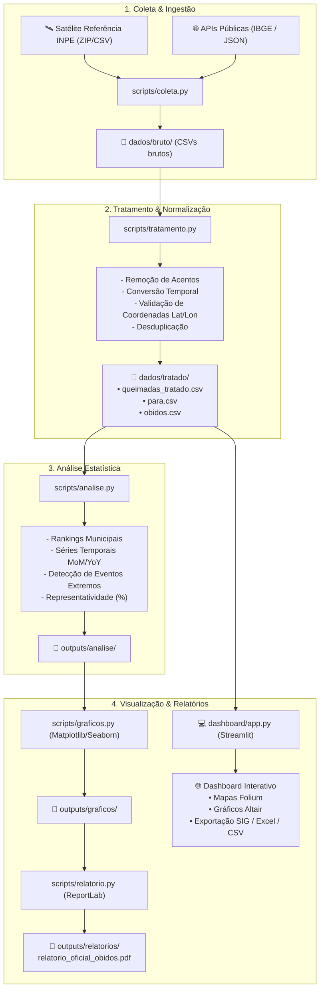
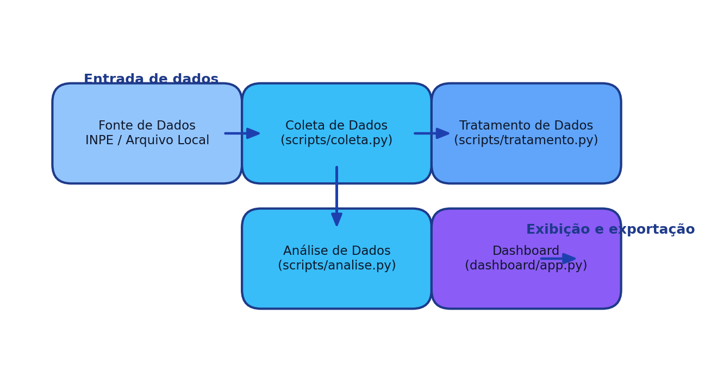

# 📐 Arquitetura do Sistema – Projeto Queimadas

Este documento detalha o fluxo arquitetural e o pipeline de engenharia de dados do **Projeto Queimadas**.

---

## 🔄 Fluxograma do Pipeline de Dados (ETL)

---

## 📋 Descrição dos Componentes

1. **Coleta de Dados (`scripts/coleta.py`)**:
   - Automatiza o download dos dados anuais do satélite de referência do INPE e de APIs JSON externas com verificação de integridade e streaming em memória.
2. **Tratamento de Dados (`scripts/tratamento.py`)**:
   - Padroniza esquemas de colunas, normaliza textos para padrão ASCII maiúsculo (compatível com GIS e bancos relacionais), trata nulos e gera índices temporais (`ano`, `mes`).
3. **Análise Estatística (`scripts/analise.py`)**:
   - Computa rankings agregados de queimadas por município, calcula variações mensais percentuais (*Month-over-Month*) e identifica períodos com surtos ou quedas atípicas (> 30%).
4. **Geração Gráfica (`scripts/graficos.py`)**:
   - Produz gráficos em alta resolução (300 DPI) para séries históricas, barras mensais com rótulos de valores, comparativos municipais e mapas de calor sazonais.
5. **Relatório Técnico Oficial (`scripts/relatorio.py`)**:
   - Compila automaticamente um documento técnico padrão A4 em formato PDF com papel timbrado, metadados governamentais, tabelas e diagnóstico ambiental.
6. **Dashboard Interativo (`dashboard/app.py`)**:
   - Interface analítica Streamlit com suporte a filtros dinâmicos de Estado/Município/Ano, mapas de calor interativos via Leaflet/Folium, visualizações em Altair e exportação geoespacial (Shapefile, GeoJSON, Excel, CSV).

---

## 🖼️ Diagrama Visual

